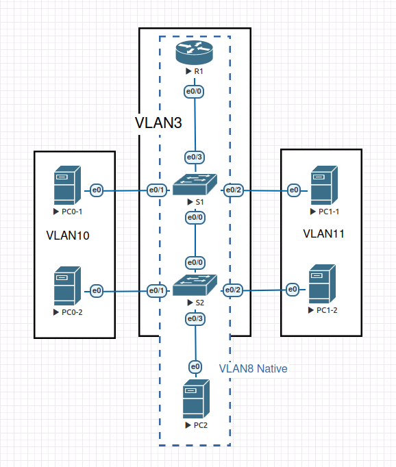

#  VLAN и маршрутизация между VLAN

###  Задание:
 1. Составить таблицу адресации и VLAN.
 2. Сконфигурировать стенд из L3 коммутатора, двух коммутаторов L2 и четырех ПК.
 3. Настроить на коммутаторах нужные vlan'ы и access порты.
 4. Создать trunk-каналы между коммутаторами L2. Проверить связность хостов.
 5. Настроить L3 коммутатор и trunk-подключение к коммутатору L2.
 6. Настроить интерфейсы management-влана на коммутаторах. Проверить связность.
 7. Реализовать маршрутизацию на L3-коммутаторе по схеме роктер-на-палочке.
 8. Настроить в качестве native vlan8.

### 1.1 Таблица адресации

 | Device        | Interface     | IP address    | Subnet mask   | Default gateway |
 | ------------- | ------------- | ------------- | ------------- | --------------- |
 | R1            | e0/0.3        | 192.168.3.1   | 255.255.255.0 | N/A             |
 |               | e0/0.8        | 192.168.8.1   | 255.255.255.0 |                 |
 |               | e0/0.10       | 192.168.10.1  | 255.255.255.0 |                 |
 |               | e0/0.11       | 192.168.11.1  | 255.255.255.0 |                 |
 | S1            | VLAN3         | 192.168.3.11  | 255.255.255.0 | 192.168.3.1     |
 | S2            | VLAN3         | 192.168.3.12  | 255.255.255.0 | 192.168.3.1     |
 | PC0-1         | e0            | 192.168.10.11 | 255.255.255.0 | 192.168.10.1    |
 | PC0-2         | e0            | 192.168.10.12 | 255.255.255.0 | 192.168.10.1    |
 | PC1-1         | e0            | 192.168.11.11 | 255.255.255.0 | 192.168.11.1    |
 | PC1-2         | e0            | 192.168.11.12 | 255.255.255.0 | 192.168.11.1    |
 | PC2           | e0            | 192.168.8.11  | 255.255.255.0 | 192.168.8.1     |

### 1.2 Таблица VLAN

  | VLAN         | Name        | Interface assigned             |
  | ------------ | ----------- | ------------------------------ |
  | VLAN1        | default     | N/A                            |
  | VLAN3        | Management  | S1/VLAN3, S2/VLAN3, R1/e0/0.3  |
  | VLAN8        | Native      | S2/e0/3                        |
  | VLAN10       | Roga        | S1/e0/1, S2/e0/1, R1/e0/0.10   |
  | VLAN11       | Kopyta      | S1/e0/2, S2/e0/2, R1/e0/0.11   |

### 2. Стенд в eve-ng.



### 3. Настроить на коммутаторах нужные vlan'ы и access порты.

####  Пример настройки на маршрутизаторе S1:
```
enable
configure terminal
vlan 3,10,11
exit
vlan3
name Management
exit
vlan10
name Roga
exit
vlan11
name Kopyta
exit
interface e0/1
switchport mode access
switchport access vlan 10
exit
interface e0/2
switchport mode access
switchport access vlan 11
end
```

### 4. Создать trunk-каналы между коммутаторами L2. Проверить связность хостов.
####  Пример настройки на маршрутизаторе S1:
```
configure terminal
interface e0/3
switchport trunk encapsulation dot1q
switchport mode trunk
switchport trunk allowed vlan 3,10,11
```

При проверке пинги между хостами одного vlan'а проходят (R1-1 <-> R1-2 или R2-1 <-> R2-2), но отсутствуют между хостами разных vlan'ов.

### 5. Настроить L3 коммутатор и trunk-подключение к коммутатору L2.
####  Пример настройки на коммутаторе R1:
```
configure terminal
interface e0/3
switchport trunk encapsulation dot1q
switchport mode trunk
switchport trunk allowed vlan 3,10,11
```

### 6. Настроить интерфейсы management-влана на коммутаторах. Проверить связность.
####  Настройка коммутатора R1:
```
configure terminal
interface Ethernet0/0.3
no shutdown
description vlan3 gateway
encapsulation dot1Q 3
ip address 192.168.3.1 255.255.255.0
exit
configure terminal
interface Ethernet0/0
no shutdown
```

На коммутаторах S1 и S2 настройка аналогочна, но используется interface vlan3.

### 7. Реализовать маршрутизацию на L3-коммутаторе по схеме роктер-на-палочке.
####  Настройка коммутатора R1:
```
configure terminal
interface Ethernet0/0.10
no shutdown
description vlan10 gateway
encapsulation dot1Q 10
ip address 192.168.10.1 255.255.255.0
end
interface Ethernet0/0.11
no shutdown
description vlan11 gateway
encapsulation dot1Q 11
ip address 192.168.11.1 255.255.255.0
```

С коммутатора R1 пингуются все конечные устройства:
```
1#ping 192.168.10.11
Type escape sequence to abort.
Sending 5, 100-byte ICMP Echos to 192.168.10.11, timeout is 2 seconds:
!!!!!
Success rate is 100 percent (5/5), round-trip min/avg/max = 1/2/5 ms
R1#ping 192.168.10.12
Type escape sequence to abort.
Sending 5, 100-byte ICMP Echos to 192.168.10.12, timeout is 2 seconds:
!!!!!
Success rate is 100 percent (5/5), round-trip min/avg/max = 1/1/2 ms
R1#ping 192.168.11.11
Type escape sequence to abort.
Sending 5, 100-byte ICMP Echos to 192.168.11.11, timeout is 2 seconds:
!!!!!
Success rate is 100 percent (5/5), round-trip min/avg/max = 1/1/1 ms
R1#ping 192.168.11.12
Type escape sequence to abort.
Sending 5, 100-byte ICMP Echos to 192.168.11.12, timeout is 2 seconds:
!!!!!
Success rate is 100 percent (5/5), round-trip min/avg/max = 1/1/2 ms
```

Пинги между устройствами VLAN10 и VLAN11 также выполняются:

```
root@PC0-1:~# ping 192.168.11.12
PING 192.168.11.12 (192.168.11.12) 56(84) bytes of data.
64 bytes from 192.168.11.12: icmp_seq=1 ttl=63 time=7.39 ms
64 bytes from 192.168.11.12: icmp_seq=2 ttl=63 time=2.71 ms
```

### 8. Настроить в качестве native vlan8.

####  Настройка коммутатора R1:
```
configure terminal
interface e0/0.8
description Native vlan gateway
encapsulation dot1q 8 native
ip add 192.168.8.1 255.255.255.0
```

####  Настройка коммутатора S1:
```
configure terminal
vlan 8
name Native
end
interface e0/0
switchport trunk native vlan 8
end
```
 - На интерфейсе e0/3 настраивается аналогично.
 - Настройка коммутатора S2 аналогична по порту e0/0 коммутатору S1. Порт e0/3 настраивается как access для vlan8:
 ```
 interface e0/3
 switchport mode access
 switchport access vlan 8
 exit
 ```
 - Также на всех trunk-интерфейсах коммутаторов S1 и S2 необходимо добавить vlan8 в список разрешенных:
 ```
 S1(config-if)#switchport trunk allowed vlan add 8
 ```
  - После этого имеется пинг с R1 до PC2:
  ```
  R1#ping 192.168.8.11
  Type escape sequence to abort.
  Sending 5, 100-byte ICMP Echos to 192.168.8.11, timeout is 2 seconds:
  !!!!!
  Success rate is 100 percent (5/5), round-trip min/avg/max = 1/1/2 ms

  ```
