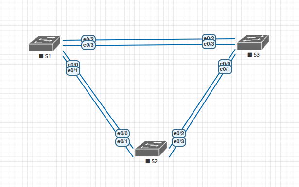

#  Развертывание коммутируемой сети с резервными каналами

###  Задание:
 1. Создание сети и настройка основных параметров устройства
 2. Выбор корневого моста
 3. Наблюдение за процессом выбора протоколом STP порта, исходя из стоимости портов
 4. Наблюдение за процессом выбора протоколом STP порта, исходя из приоритета портов

### 1 Создание сети и настройка основных параметров устройства
#### 1.1 Создание сети.

В eve-ng создана сеть из трех коммутаторов следующей топологии:


##### Таблица адресации
| Device        | Interface     | IP address    | Subnet mask   |
| ------------- | ------------- | ------------- | ------------- |
| S1            | VLAN1         | 192.168.1.1   | 255.255.255.0 |
| S2            | VLAN1         | 192.168.1.2   | 255.255.255.0 |
| S3            | VLAN1         | 192.168.1.3   | 255.255.255.0 |

#### 1.2 Настройка основных параметров устройства

 - a. Отключите поиск DNS.
 ```
 Switch(config)#no ip domain-lookup
 ```
 - b. Присвойте имена устройствам в соответствии с топологией.
 ```
 Switch(config)#hostname S1
 ```
 - c. Назначьте class в качестве зашифрованного пароля доступа к привилегированному режиму.
 ```
#S1(config)#aaa new-model
S1(config)#service password-encryption
S1(config)#enable secret class
 ```
 - d. Назначьте cisco в качестве паролей консоли и VTY и активируйте вход для консоли и VTY каналов.
```
S1(config)#line vty console 0
S1(config-line)#password cisco
S1(config-line)#login
```
 - e. Настройте logging synchronous для консольного канала.
 ```
S1(config)#line vty 0 4
S1(config-line)#logging synchronous
 ```
 - f. Настройте баннерное сообщение дня (MOTD) для предупреждения пользователей о запрете несанкционированного доступа.
 ```
 S1(config)#banner motd "This is a secure system. Authorized Access Only!"
 ```

 - g. Задайте IP-адрес, указанный в таблице адресации для VLAN 1 на всех коммутаторах.
 ```
S1(config)#interface vlan1
S1(config-if)#ip address 192.168.1.1 255.255.255.0
S1(config-if)#no shutdown
S1(config-if)#end
S1#ping 192.168.1.1
Type escape sequence to abort.
Sending 5, 100-byte ICMP Echos to 192.168.1.1, timeout is 2 seconds:
!!!!!
Success rate is 100 percent (5/5), round-trip min/avg/max = 4/4/5 ms
 ```

 - h. Скопируйте текущую конфигурацию в файл загрузочной конфигурации.
 ```
 S1#copy running-config startup-config
 Destination filename [startup-config]?
 Building configuration...
 Compressed configuration from 983 bytes to 719 bytes[OK]
 ```
