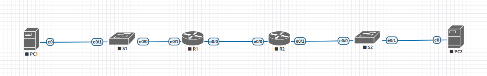

#  DHCP

###  Задание:
 1. Создание сети и настройка основных параметров устройств.
 2. Настройка DHCPv4.
 3. Настройка DHCPv6.


### 1 Создание сети и настройка основных параметров устройств.

#### 1.1 Таблица адресации.

 | Device        | Interface     | IP address    | Subnet mask     | Default gateway |
 | ------------- | ------------- | ------------- | --------------- | --------------- |
 | R1            | e0/0          | 10.0.0.1      | 255.255.255.252 | N/A             |
 |               | e0/1          | N/A           | N/A             |                 |
 |               | e0/1.100      | 192.168.10.1  | 255.255.255.0   |                 |
 |               | e0/1.200      | 192.168.11.1  | 255.255.255.0   |                 |
 |               | e0/1.1000     | N/A           |                 |                 |
 | R2            | e0/0          | 10.0.0.2      | 255.255.255.252 | N/A             |
 |               | e0/1          | 192.168.1.1   | 255.255.255.0   |                 |
 | S1            | VLAN 200      | 192.168.11.2  |                 |                 |
 | S2            | VLAN 1        | 192.168.1.2   |                 |                 |
 | PC1           | e0            | DHCP          | DHCP            | DHCP            |
 | PC2           | e0            | DHCP          | DHCP            | DHCP            |


#### 1.2 Таблица VLAN.

  | VLAN         | Name        | Interface assigned             |
  | ------------ | ----------- | ------------------------------ |
  | 1            | N/A         | S2: e0/1                       |
  | 100          | Clients     | S1: e0/1                       |
  | 200          | Management  | S1: VLAN200                    |
  | 999          | X           | S1: e0/2-3                     |
  | 1000         | Native      | N/A                            |

#### 1.3 Создание сети.

  В eve-ng создана сеть следующей топологии:
  

#### 1.4 Настройка основных параметров устройств.
##### Настройка S1, S2, R1 и R2 на примере S1.

 - a. Присвойте имена устройствам в соответствии с топологией.
 ```
 Switch(config)#hostname S1
 ```
 - b. Отключите поиск DNS.
 ```
 Switch(config)#no ip domain-lookup
 ```
 - c. Назначьте class в качестве зашифрованного пароля доступа к привилегированному режиму.
 ```
 S1(config)#service password-encryption
 S1(config)#enable secret class
 ```
 - d. Назначьте cisco в качестве паролей консоли и VTY и активируйте вход для консоли и VTY каналов.
 ```
 S1(config)#line console 0
 S1(config-line)#password cisco
 S1(config-line)#login
 S1(config)#exit
 S1(config)#line vty 0 4
 S1(config-line)#password cisco
 S1(config-line)#login
 S1(config)#exit
 ```
 - e. Настройте logging synchronous для консольного канала.
 ```
 S1(config)#line console 0
 S1(config-line)#logging synchronous
 ```
 - f. Настройте баннерное сообщение дня (MOTD) для предупреждения пользователей о запрете несанкционированного доступа.
 ```
 S1(config)#banner motd "This is a secure system. Authorized Access Only!"
 ```

 - g. Скопируйте текущую конфигурацию в файл загрузочной конфигурации.
 ```
 S1#copy running-config startup-config
 Destination filename [startup-config]?
 Building configuration...
 Compressed configuration from 983 bytes to 719 bytes[OK]
 ```

 - h. Установите текущую дату и время.
 ```
 S1#clock set 19:45:55 sep 20 2023
 ```

#### 1.5 Настройка межвлановой маршрутизации на R1.
 - a. Активация интерфейса e0/1
 ```
 R1(config)#interface e0/1
 R1(config-if)#no shutdown
 ```
 - b. Настройка субинтерфейсов vlan и назначение им ip-адресов согласно плану.  
```
R1(config)#interface e0/1.100
R1(config-subif)#description vlan100 gw
R1(config-subif)#encapsulation dot1Q 100
R1(config-subif)#ip address 192.168.10.1 255.255.255.0
R1(config-subif)#no shutdown
R1(config-subif)#exit
R1(config)#interface e0/1.200
R1(config-subif)#description vlan200 gw
R1(config-subif)#encapsulation dot1Q 200
R1(config-subif)#ip address 192.168.11.1 255.255.255.0
R1(config-subif)#no shutdown
R1(config-subif)#exit
R1(config)#interface e0/1.1000
R1(config-subif)#description native vlan1000 nogw
R1(config-subif)#encapsulation dot1Q 1000 native
R1(config-subif)#no shutdown
R1(config-subif)#exit
```
 - c. Проверка настроенных интерфейсов.
```
#show ip interface brief
Interface                  IP-Address      OK? Method Status                Protocol
Ethernet0/0                unassigned      YES NVRAM  up                    up      
Ethernet0/1                unassigned      YES NVRAM  up                    up      
Ethernet0/1.100            192.168.10.1    YES manual up                    up      
Ethernet0/1.200            192.168.11.1    YES manual up                    up      
Ethernet0/1.1000           unassigned      YES unset  up                    up      
Ethernet0/2                unassigned      YES NVRAM  administratively down down    
Ethernet0/3                unassigned      YES NVRAM  administratively down down

R1#show interfaces         
Ethernet0/0 is up, line protocol is up
...
Ethernet0/1 is up, line protocol is up
  Hardware is AmdP2, address is aabb.cc00.3010 (bia aabb.cc00.3010)
  MTU 1500 bytes, BW 10000 Kbit/sec, DLY 1000 usec,
     reliability 255/255, txload 1/255, rxload 1/255
  Encapsulation 802.1Q Virtual LAN, Vlan ID  1., loopback not set
...
Ethernet0/1.100 is up, line protocol is up
  Hardware is AmdP2, address is aabb.cc00.3010 (bia aabb.cc00.3010)
  Description: vlan100 gw
  Internet address is 192.168.10.1/24
  MTU 1500 bytes, BW 10000 Kbit/sec, DLY 1000 usec,
     reliability 255/255, txload 1/255, rxload 1/255
  Encapsulation 802.1Q Virtual LAN, Vlan ID  100.
...
Ethernet0/1.200 is up, line protocol is up
  Hardware is AmdP2, address is aabb.cc00.3010 (bia aabb.cc00.3010)
  Description: vlan200 gw
  Internet address is 192.168.11.1/24
  MTU 1500 bytes, BW 10000 Kbit/sec, DLY 1000 usec,
     reliability 255/255, txload 1/255, rxload 1/255
  Encapsulation 802.1Q Virtual LAN, Vlan ID  200.
...
Ethernet0/1.1000 is up, line protocol is up
  Hardware is AmdP2, address is aabb.cc00.3010 (bia aabb.cc00.3010)
  Description: native v1000 nogw
  MTU 1500 bytes, BW 10000 Kbit/sec, DLY 1000 usec,
     reliability 255/255, txload 1/255, rxload 1/255
  Encapsulation 802.1Q Virtual LAN, Vlan ID  1000.
```

#### 1.6 Настройка интерфейсов и статической маршрутизации на R2.
 - a. Настройкаа ip-адреса на интерфейсе e0/1.
 ```
R2(config-if)#no shutdown
Sep 24 10:14:24.285: %LINK-3-UPDOWN: Interface Ethernet0/1, changed state to up
Sep 24 10:14:25.291: %LINEPROTO-5-UPDOWN: Line protocol on Interface Ethernet0/1, changed state to up
R2(config-if)#ip address 192.168.1.1 255.255.255.0
 ```
 - b. Настройка e0/0 для каждого роутера согласно плана.
 ```
 R1(config)#interface e0/0
 R1(config-if)#no shutdown
 R1(config-if)#ip address 10.0.0.1 255.255.255.252
 R1(config-if)#end

 R2(config)#interface e0/0
 R2(config-if)#no shutdown
 R2(config-if)#ip address 10.0.0.2 255.255.255.252
 R2(config-if)#end
 R2#ping 10.0.0.1
 Type escape sequence to abort.
 Sending 5, 100-byte ICMP Echos to 10.0.0.1, timeout is 2 seconds:
 !!!!!
 Success rate is 100 percent (5/5), round-trip min/avg/max = 1/1/1 ms

 R1#ping 10.0.0.2
 Type escape sequence to abort.
 Sending 5, 100-byte ICMP Echos to 10.0.0.1, timeout is 2 seconds:
 !!!!!
 Success rate is 100 percent (5/5), round-trip min/avg/max = 1/1/1 ms
 ```
 - c. Настройка маршрутов на сети обоих коммутаторов.
 ```

  R2(config)#ip route 192.168.10.0 255.255.255.0 10.0.0.1
  R2(config)#ip route 192.168.11.0 255.255.255.0 10.0.0.1
  R2(config)#exit

  R1(config)#ip route 192.168.1.0 255.255.255.0 10.0.0.2
  R1(config)#exit
  R1#ping 192.168.1.1
  Type escape sequence to abort.
  Sending 5, 100-byte ICMP Echos to 192.168.1.1, timeout is 2 seconds:
  !!!!!
  Success rate is 100 percent (5/5), round-trip min/avg/max = 1/1/1 ms

  R2#ping 192.168.10.1
  Type escape sequence to abort.
  Sending 5, 100-byte ICMP Echos to 192.168.10.1, timeout is 2 seconds:
  !!!!!
  Success rate is 100 percent (5/5), round-trip min/avg/max = 1/1/1 ms
  R2#ping 192.168.11.1
  Type escape sequence to abort.
  Sending 5, 100-byte ICMP Echos to 192.168.11.1, timeout is 2 seconds:
  !!!!!
  Success rate is 100 percent (5/5), round-trip min/avg/max = 1/1/5 ms
 ```
#### 1.7 Настройка vlan коммутатора S1.
 - a. Создать и поименовать вланы согласно таблице.
 ```
  S1(config)#vlan 100,200,999,1000
  S1(config-vlan)#no shutdown
  %VLAN 100 is not shutdown.
  %VLAN 200 is not shutdown.
  %VLAN 999 is not shutdown.
  %VLAN 1000 is not shutdown.
  S1(config-vlan)#exit
  S1(config)#vlan 100
  S1(config-vlan)#name Clients
  S1(config-vlan)#exit
  S1(config)#vlan 200
  S1(config-vlan)#name Management
  S1(config-vlan)#exit
  S1(config)#vlan 999
  S1(config-vlan)#name Parking_Lot
  S1(config-vlan)#exit
  S1(config)#vlan 1000
  S1(config-vlan)#name Native
  S1(config-vlan)#exit
 ```
 - b. Сконфигурировать интерфейс управления и маршрут по-умолчанию на S1.
 ```
  S1(config)#interface vlan 200
  S1(config-if)#ip address 192.168.11.2 255.255.255.0
  S1(config-if)# exit
  S1(config)#ip default-gateway 192.168.11.1
 ```
 - с. Сконфигурировать интерфейс управления и маршрут по-умолчанию на S2.
 ```
  S2(config)#interface vlan 1
  S2(config-if)#no shutdown
  S2(config-if)#ip address 192.168.1.2 255.255.255.0
  S2(config-if)#exit
  S2(config)#ip default-gateway 192.168.1.1
 ```
 - d. Назначить неиспользуемым портам на S1 vlan999 и отключить их.
 ```
  S1(config)#interface range e0/2-3
  S1(config-if-range)#switchport mode access
  S1(config-if-range)#switchport access vlan 999
  S1(config-if-range)#shutdown
 ```
 - e. Назначить используемым портам vlan на S1.
```
  S1(config)#interface e0/1
  S1(config-if)#switchport mode access
  S1(config-if)#switchport access vlan 100
  S1(config-if)#no shutdown
```
 - f. Настроить trunk-интерфейс на S1.
 ```
S1(config)#interface e0/0
S1(config-if)#switchport trunk encapsulation dot1q
S1(config-if)#switchport mode trunk
S1(config-if)#switchport trunk allowed vlan 100,200,999,1000
S1(config-if)#switchport trunk native vlan 1000
S1(config-if)#no shutdown
 ```
### 2 Настройка DHCPv4.
#### 2.1 Настройка DHCPv4 для сети Clients.
 - a. Исключить пять первых адресов.
```
R1(config)#ip dhcp excluded-address 192.168.10.1 192.168.10.5
```
 - b. Создать dhcp-пул с уникальным именем.
 ```
 R1(config)#ip dhcp pool pool_clients
 ```
 - c. Задать сеть.
 ```
 R1(dhcp-config)#network 192.168.10.0 255.255.255.0
 ```
 - d. Задать доменное имя.
 ```
 R1(dhcp-config)#domain-name clients.com
 ```
 - e. Задать маршрут по-умолчанию.
 ```
 R1(dhcp-config)#default-router 192.168.10.1
 ```
 - f. Установить время аденды 2 дня 12 часов и 30 минут.
 ```
 R1(dhcp-config)#lease 2 12 30
 ```
#### 2.1 Проверить конфигурацию DHCPv4 сети Clients.
 - a. Проверить настройки на роутере.
```
R1#show ip dhcp pool

Pool pool_clients :
 Utilization mark (high/low)    : 100 / 0
 Subnet size (first/next)       : 0 / 0
 Total addresses                : 254
 Leased addresses               : 1
 Pending event                  : none
 1 subnet is currently in the pool :
 Current index        IP address range                    Leased addresses
 192.168.10.7         192.168.10.1     - 192.168.10.254    1

 R1#show ip dhcp binding
 Bindings from all pools not associated with VRF:
 IP address          Client-ID/	 	    Lease expiration        Type
 		    Hardware address/
 		    User name
 192.168.10.6        0050.0000.0500          Sep 27 2023 07:13 AM    Automatic

 R1#show ip dhcp server statistics
Memory usage         48711
Address pools        1
Database agents      0
Automatic bindings   1
Manual bindings      0
Expired bindings     0
Malformed messages   0
Secure arp entries   0

Message              Received
BOOTREQUEST          0
DHCPDISCOVER         7
DHCPREQUEST          3
DHCPDECLINE          0
DHCPRELEASE          2
DHCPINFORM           0

Message              Sent
BOOTREPLY            0
DHCPOFFER            3
DHCPACK              3
DHCPNAK              0

```
 - b. Проверить адрес PC1.
 ```
 root@PC1:~# ip addr
...
2: ens3: <BROADCAST,MULTICAST,UP,LOWER_UP> mtu 1500 qdisc pfifo_fast state UP group default qlen 1000
    link/ether 00:50:00:00:05:00 brd ff:ff:ff:ff:ff:ff
    inet 192.168.10.6/24 brd 192.168.10.255 scope global ens3
       valid_lft forever preferred_lft forever
    inet6 fe80::250:ff:fe00:500/64 scope link
       valid_lft forever preferred_lft forever
 root@PC1:~# ip route
default via 192.168.10.1 dev ens3
192.168.10.0/24 dev ens3  proto kernel  scope link  src 192.168.10.6
 ```
#### 2.3 Настроить DHCPv4 пул для сети коммутатора 2.
 - a. По аналогии с первым пулом.
 ```
  R1(config)#ip dhcp excluded-address 192.168.1.1 192.168.1.5  
  R1(config)#ip dhcp pool pool_others
  R1(dhcp-config)#network 192.168.1.0 255.255.255.0
  R1(dhcp-config)#domain-name others.com
  R1(dhcp-config)#default-router 192.168.1.1
  R1(dhcp-config)#lease 2 12 30
 ```
 - b. Настройка dhcp-relay на R2.
 ```
 R2(config)#interface e0/1
 R2(config-if)#ip helper-address 10.0.0.1
 ```
 - c. Проверка работы DHCPv4 на R2.
 ```
 R1#show ip dhcp binding
Bindings from all pools not associated with VRF:
IP address          Client-ID/	 	    Lease expiration        Type
		    Hardware address/
		    User name
192.168.1.6         0050.0000.0600          Sep 27 2023 07:32 AM    Automatic
192.168.10.6        0050.0000.0500          Sep 27 2023 07:13 AM    Automatic

root@PC2:~# ip addr
...
2: ens3: <BROADCAST,MULTICAST,UP,LOWER_UP> mtu 1500 qdisc pfifo_fast state UP group default qlen 1000
    link/ether 00:50:00:00:06:00 brd ff:ff:ff:ff:ff:ff
    inet 192.168.1.6/24 brd 192.168.1.255 scope global ens3
       valid_lft forever preferred_lft forever
    inet6 fe80::250:ff:fe00:600/64 scope link
       valid_lft forever preferred_lft forever

 ```
### 3. Настройка DHCPv6.
#### 3.1 Таблица адресации.

| Device        | Interface     | IPv6 address           |
| ------------- | ------------- | ---------------------- |
| R1            | e0/0          | 2001:db8:acad:2::1/64  |
|               |               | fe80::1                |
|               | e0/1.100      | 2001:db8:acad:1::1/64  |
|               |               | fe80::1                |
| R2            | e0/0          | 2001:db8:acad:2::2/64  |
|               |               | fe80::2                |
|               | e0/1          | 2001:db8:acad:3::1/64  |
|               |               | fe80::1                |
| PC1           | e0            | DHCP                   |
| PC2           | e0            | DHCP                   |

#### 3.2 Топология сети.

Топология сети та же, что для v4.

#### 3.3 Настройка интерфейсов и маршрутизации на обоих роутерах.
 - a. Настройка адресов интерфейсов в соответствии с таблицей адресации.
 ```
 R1(config)#interface e0/0
 R1(config-if)#ipv6 address fe80::1 link-local
 R1(config-if)#ipv6 address 2001:db8:acad:2::1/64
 R1(config-if)#exit
 R1(config)#interface e0/1.200
 R1(config-subif)#ipv6 address fe80::1 link-local
 R1(config-subif)#ipv6 address 2001:db8:acad:1::1/64
 ```
 - b. На R2 настройка аналогична.

 - с. Включение маршрутизации.
 ```
 R1(config)#ipv6 unicast-routing
 R2(config)#ipv6 unicast-routing
 ```
 - d. Настроить маршрутами по умолчанию на обоих роутерах адреса интерфейсов e0/0 на соседе.
 ```
  R1(config)#ipv6 route ::/0 2001:db8:acad:2::2
  R2(config)#ipv6 route ::/0 2001:db8:acad:2::1
 ```
 - e. Проверка пингом адреса интерфейса e0/1 соседнего роутера.
 ```
 R1#ping 2001:db8:acad:3::1
 Type escape sequence to abort.
 Sending 5, 100-byte ICMP Echos to 2001:DB8:ACAD:3::1, timeout is 2 seconds:
 !!!!!
 Success rate is 100 percent (5/5), round-trip min/avg/max = 1/1/1 ms

 R2#ping 2001:db8:acad:1::1
 Type escape sequence to abort.
 Sending 5, 100-byte ICMP Echos to 2001:DB8:ACAD:1::1, timeout is 2 seconds:
 !!!!!
 Success rate is 100 percent (5/5), round-trip min/avg/max = 1/1/1 ms
 ```

 - f. Настройка SLAAC на S1.
 ```
 S1(config)#interface vlan 200
 S1(config-if)#ipv6 enable
 S1(config-if)#ipv6 address autoconfig
 S1(config-if)#do show ipv6 interface brief
...
 Vlan200                [up/up]
    FE80::A8BB:CCFF:FE80:1000
    2001:DB8:ACAD:1:A8BB:CCFF:FE80:1000
 ```

#### 3.4 Настройка и проверка DHCPv6 на R1.
##### 3.4.1 Настройка stateless DHCPv6 на R1.
 - a. Настроить R1 как stateless DHCPv6 сервер.
 ```
 R1(config)#ipv6 dhcp pool R1-STATELESS
 R1(config-dhcpv6)# address prefix 2001:db8:acad:3:aaa::/80
 R1(config-dhcpv6)#dns-server 2001:db8:acad::254
 R1(config-dhcpv6)#domain-name STATELESS.com
 R1(config-dhcpv6)#exit
 R1(config)#interface e0/1.200
 R1(config-subif)#ipv6 nd other-config-flag
 R1(config-subif)#ipv6 dhcp server R1-STATELESS
 ```
 - b. Проверка интерфейса S1.
 ```
 S1#show ipv6 dhcp interface   
 Vlan200 is in client mode
   Prefix State is IDLE (0)
   Information refresh timer expires in 23:58:52
   Address State is SOLICIT (10)
   Retransmission timer expires in 00:00:41
   List of known servers:
     Reachable via address: FE80::1
     DUID: 00030001AABBCC003000
     Preference: 0
     Configuration parameters:
       DNS server: 2001:DB8:ACAD::254
       Domain name: STATELESS.com
       Information refresh time: 0
   Prefix Rapid-Commit: disabled
   Address Rapid-Commit: disabled

 ```
##### 3.4.2 Настройка stateful DHCPv6 на R1 для ретрансляции с R2.
 - a. Настройка R1 .
 ```
 R1(config)#ipv6 dhcp pool R2-STATEFUL
 R1(config-dhcpv6)#address prefix 2001:db8:acad:3:aaa::/80
 R1(config-dhcpv6)#dns-server 2001:db8:acad::254
 R1(config-dhcpv6)#domain-name STATEFUL.com
 R1(config-dhcpv6)#exit
 R1(config)#interface e0/0
 R1(config-if)#ipv6 dhcp server R2-STATEFUL
 ```
 - b. Настройка ретрансляции dhcpv6 на R2.
 ```
 R2(config)#interface e0/1
 R2(config-if)#ipv6 nd managed-config-flag
 R2(config-if)#ipv6 dhcp relay destination 2001:db8:acad:2::1 e0/0
 ```
 - c. Настройка S2 на получение DHCPv6.
 ```
 S2(config)#interface vlan1
 S2(config-if)#ipv6 enable
 S2(config-if)#ipv6 address dhcp

 S2#show ipv6 dhcp interface
Vlan1 is in client mode
  Prefix State is IDLE
  Address State is OPEN
  Renew for address will be sent in 11:59:56
  List of known servers:
    Reachable via address: FE80::1
    DUID: 00030001AABBCC003000
    Preference: 0
    Configuration parameters:
      IA NA: IA ID 0x00070001, T1 43200, T2 69120
        Address: 2001:DB8:ACAD:3:AAA:239B:6273:1087/128
                preferred lifetime 86400, valid lifetime 172800
                expires at Sep 17 2023 03:49 PM (172797 seconds)
      DNS server: 2001:DB8:ACAD::254
      Domain name: STATEFUL.com
      Information refresh time: 0
  Prefix Rapid-Commit: disabled
  Address Rapid-Commit: disabled

 ```
